# couplingguard

[](https://github.com/Meru143/couplingguard)
[](https://github.com/Meru143/couplingguard/actions/workflows/ci.yml)

> **Status: v0.1.0 — first release.** The `Meru143/couplingguard@v1` tag and the `couplingguard` PyPI package both ship after the first tagged release lands. Until then, pin to a commit SHA or install from source.

Detect file coupling risk in pull requests from git co-change history. A free GitHub Action that posts a collapsible markdown comment on every PR with normalized coupling scores for the changed files, suggests reviewers from CODEOWNERS for the coupled files, edits itself with a delta line on re-push, and can optionally fail the build above a configurable threshold.

GitLab CI is supported via the same algorithm — set `GITLAB_TOKEN` and the action posts an MR note instead.

## Install in 5 lines

```yaml
name: Coupling Guard
on:
  pull_request:
    types: [opened, synchronize, reopened]

permissions:
  contents: read
  pull-requests: write

jobs:
  coupling:
    runs-on: ubuntu-latest
    steps:
      - uses: actions/checkout@v4
        with:
          fetch-depth: 0     # required: couplingguard needs the full git log
      - uses: Meru143/couplingguard@v1
        with:
          github_token: ${{ github.token }}
```

## What the PR comment looks like

**Real output** from running couplingguard against its own repository
(synthetic PR over 10 commits of real history, captured from
`tests/e2e/test_dogfood.py`):

> 🔍 **couplingguard — 6 pairs detected, highest risk: 🔴 1.00**
>
> | File in PR | Coupled With | Score | Risk | Co-changes |
> |---|---|---|---|---|
> | `pyproject.toml` | `skills-lock.json` | 1.00 | 🔴 High | 2/2 commits |
> | `tests/integration/test_github_poster.py` | `tests/integration/test_gitlab_poster.py` | 1.00 | 🔴 High | 2/2 commits |
> | `.gitignore` | `pyproject.toml` | 0.67 | 🟡 Medium | 2/3 commits |
> | `.gitignore` | `skills-lock.json` | 0.67 | 🟡 Medium | 2/3 commits |

Note the paired integration test files at 1.00 — `test_github_poster.py` and
`test_gitlab_poster.py` always land in the same commit because they cover
mirror-image functionality. A reviewer looking only at the GitHub test
file would benefit from knowing the GitLab one almost certainly changed
too.

**Illustrative example** showing the score-delta line on re-push and
CODEOWNERS-based reviewer suggestions (the names are placeholders — the
real action only suggests usernames that actually appear in your
`CODEOWNERS` file):

> 🔍 **couplingguard — 2 pairs detected, highest risk: 🔴 0.82**
>
> ⚠️ Score changed since last push: 🟡 0.45 → 🔴 0.82 ↑
>
> | File in PR | Coupled With | Score | Risk | Co-changes |
> |---|---|---|---|---|
> | `src/payment.py` | `src/billing.py` | 0.82 | 🔴 High | 41/50 commits |
> | `src/payment.py` | `tests/test_billing.py` | 0.64 | 🟡 Medium | 32/50 commits |
>
> _Suggested reviewers for coupled files: @alice, @team-payments_

The comment is collapsible (`<details>`-wrapped) and edits itself on
every push to the PR with a "score changed" line showing the delta.

## Inputs

| Input | Type | Default | Description |
|---|---|---|---|
| `github_token` | string | `${{ github.token }}` | Token for PR comment + check |
| `gitlab_token` | string | `""` | Personal access token for GitLab CI |
| `lookback_days` | number | `90` | Days of history to analyze |
| `min_occurrences` | number | `3` | Minimum co-change count to include a pair |
| `max_pairs` | number | `10` | Maximum pairs shown in the comment |
| `low_threshold` | number | `0.3` | Score boundary 🟢 → 🟡 |
| `high_threshold` | number | `0.7` | Score boundary 🟡 → 🔴 |
| `fail_threshold` | string | `""` | `low`/`medium`/`high` to fail CI; empty disables |
| `exclude` | string | `""` | Newline-separated glob patterns |
| `publish_dashboard` | boolean | `false` | Generate static dashboard + history + badge artifact |
| `dry_run` | boolean | `false` | Print comment to stdout; don't post |

## How it works

```mermaid
flowchart TD
    A[git log<br/>lookback_days, no-merges] --> B[co-change matrix<br/>file pairs × commit count]
    B --> C[normalize<br/>score = co_count / max&#40;count_a, count_b&#41;]
    C --> D{filter by<br/>min_occurrences}
    D --> E[PR analyzer<br/>keep pairs touching PR files]
    E --> F[classify risk<br/>🟢 &lt; 0.3 ≤ 🟡 &lt; 0.7 ≤ 🔴]
    F --> G[CODEOWNERS lookup<br/>suggest reviewers]
    G --> H[render markdown<br/>+ hidden JSON marker]
    H --> I[find existing<br/>PR comment by marker]
    I -->|exists| J[edit in place<br/>with delta line]
    I -->|new| K[create issue comment]
    J --> L[fail_threshold check<br/>exit 0 / 1]
    K --> L
    L --> M{publish_dashboard?}
    M -->|yes| N[append history JSON<br/>+ Chart.js HTML<br/>+ shields.io badge]
    M -->|no| O[done]
    N --> O

    style A fill:#fef3c7,stroke:#f59e0b,color:#000
    style C fill:#dbeafe,stroke:#3b82f6,color:#000
    style F fill:#fce7f3,stroke:#ec4899,color:#000
    style L fill:#dcfce7,stroke:#16a34a,color:#000
```



The key insight is **normalization**: raw co-change counts inflate for
old / large files, while `co_count / max(count_a, count_b)` produces a
0–1 ratio that's comparable across repos of any size and age.

## Local CLI

After v0.1.0 ships on PyPI:

```bash
pip install couplingguard
couplingguard --repo . --dry-run --lookback-days 90
```

Pre-release (install from source):

```bash
pip install git+https://github.com/Meru143/couplingguard.git@main
couplingguard --repo . --dry-run --lookback-days 90
```

The CLI uses the same code as the Action; `--dry-run` prints the rendered comment to stdout without trying to reach GitHub.

## GitLab CI

```yaml
coupling:
  image: python:3.11
  variables:
    GIT_DEPTH: "0"                     # required: GitLab clones shallow by default
    GITLAB_TOKEN: ${GITLAB_TOKEN}
  script:
    - pip install couplingguard
    - couplingguard --repo .
  only:
    - merge_requests
```

`CI_SERVER_URL`, `CI_PROJECT_ID`, and `CI_MERGE_REQUEST_IID` are
auto-set by every GitLab Runner. `GITLAB_TOKEN` should be a
[project access token](https://docs.gitlab.com/ee/user/project/settings/project_access_tokens.html)
with the `api` scope, stored as a masked CI/CD variable.

## Permissions

For GitHub Actions, couplingguard needs:
- `contents: read` to read the git history.
- `pull-requests: write` to post / edit the comment.

For GitLab CI, the `GITLAB_TOKEN` needs `api` scope on the project.

When `publish_dashboard: true`, the action writes `coupling-history.json`,
`coupling-dashboard.html`, and `coupling-score.json` to the workspace and
uploads them as a GitHub Actions artifact. Nothing is committed back to
your repo unless you add an explicit `git commit && git push` step yourself.

## FAQ

**Why `fetch-depth: 0`?** Default `actions/checkout@v4` does a shallow clone (depth=1). couplingguard needs the full log to count co-changes. If you forget, the action exits 1 with an actionable error rather than producing wrong results.

**What is normalization?** A pair where `a.py` was touched 100 times, `b.py` 5 times, and both together 5 times is *not* the same as a pair where both were touched 5 times each. Raw count = 5 in both cases. Normalized: 5/100 = 0.05 vs 5/5 = 1.00. The second pair is genuinely coupled; the first is noise.

**Does this work on monorepos?** Yes. Use `exclude` to drop noisy paths (docs, migrations) and bump `min_occurrences` to filter rare pairs. The matrix is built once per run and scales linearly with `lookback_days × avg_files_per_commit`.

**What if my repo has fewer than `min_occurrences` commits?** The action posts an informational comment and exits 0 — no false failures on new repos.

## Differentiators

- **vs CodeScene** — Free and open source; runs entirely in your CI with no external service. CodeScene is a commercial product with per-seat pricing.
- **vs [code-maat](https://github.com/adamtornhill/code-maat)** — code-maat is a Clojure CLI for post-hoc analysis: you run it against a checked-out repo and read CSV. couplingguard runs at PR time, produces normalized scores, and posts directly to the PR.
- **vs Danger.js** — Danger is a framework where you write the analysis rules yourself. couplingguard is a zero-config drop-in.
- **vs CODEOWNERS** — Static ownership vs dynamic co-change. Complementary: couplingguard uses CODEOWNERS to suggest *better* reviewers for the files historically coupled to your PR's files.

## Limitations

Known constraints in v0.1.0:

- **Shallow clones are rejected.** Detected and surfaced as error E001 with an actionable message. Add `fetch-depth: 0` (GitHub) or `GIT_DEPTH: "0"` (GitLab).
- **PR file cap at 200.** PRs touching more than 200 files are truncated with a warning. The pairs analysis is O(200 × matrix_size), so this is a deliberate ceiling.
- **No auto-commit of dashboard files.** `publish_dashboard: true` produces an artifact; pushing the score JSON back to `main` for badge updates is on the v0.2 roadmap.
- **GitLab self-managed not officially tested.** Should work via `CI_SERVER_URL` but only tested against gitlab.com.
- **Bitbucket / Azure DevOps** — not supported in v0.1.0.

## Contributing

See [CONTRIBUTING.md](CONTRIBUTING.md). Bugs → [Issues](https://github.com/Meru143/couplingguard/issues). Security → [SECURITY.md](SECURITY.md).

## Publishing to the GitHub Marketplace

GitHub Marketplace categories and featured tags are configured **in the
GitHub web UI**, not in `action.yml`. After tagging a release:

1. Open the new release on the **Releases** page.
2. Click **Publish this Action to the GitHub Marketplace**.
3. Accept the Marketplace terms.
4. Choose **two categories** from the dropdown — recommended:
   *Code quality* and *Continuous integration*.
5. Add **featured tags**: `code-quality`, `pull-request`, `git`,
   `coupling`, `static-analysis`.

The `branding.icon` (`git-branch`) and `branding.color` (`orange`) from
`action.yml` are picked up automatically as the listing badge.

## License

MIT. See [LICENSE](LICENSE).
