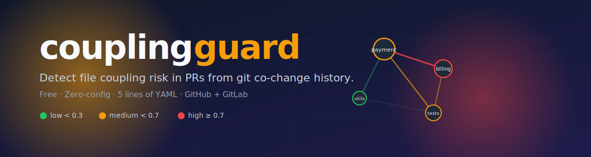

<p align="center">
  
</p>

<p align="center">
  <a href="https://pypi.org/project/couplingguard/"></a>
  <a href="https://github.com/marketplace/actions/couplingguard"></a>
  <a href="https://github.com/Meru143/couplingguard"></a>
  <a href="https://github.com/Meru143/couplingguard/actions/workflows/ci.yml"></a>
  <a href="LICENSE"></a>
  <a href="https://pypi.org/project/couplingguard/"></a>
</p>

<p align="center">
  <a href="#install-in-5-lines"></a>
  <a href="#gitlab-ci"></a>
  
  
  
  
  
  
</p>

> **What it is.** `couplingguard` is a free GitHub Action and GitLab CI integration that detects **file coupling risk in pull requests** by analyzing your repository's git co-change history. On every PR it posts a collapsible markdown comment with normalized coupling scores for the files you're changing, suggests reviewers from `CODEOWNERS`, and can optionally fail CI above a configurable risk threshold. Install in 5 lines of YAML. No signup, no hosted service, MIT licensed.

**The hidden cost of code review:** two files that always break together still ship in the same PR with no one looking at both sides. Your `git log` has known about this pairing for months — every co-change is a data point. Nobody reads it. couplingguard does, on every PR, before merge.

The leverage point is *PR open time*, not the post-incident review. AI coding agents (Copilot, Claude Code, Cursor) now routinely land diffs touching 15–30 files at once; coupling risk has never been higher or harder to spot by scrolling a unified diff. This is the cheapest bug-prevention tool you can add to your stack: five lines of YAML, an MIT license, and a comment on every PR.

<p align="center">
  
</p>

> 🎬 **The demo above is a real rendered video** ([source MP4](assets/couplingguard-demo.mp4), 24 s, 1080p, 2.1 MB). Built with [Remotion](https://remotion.dev/) — the source composition lives at [`demo/remotion/`](demo/remotion/). Run `npm install && npm run build` in that folder to re-render it yourself (`npm run build:gif` produces the inline-embeddable version above). An accessible static SVG fallback is at [`assets/animated-demo.svg`](assets/animated-demo.svg).

## Who is this for?

| If you are… | What couplingguard gives you |
|---|---|
| **A platform engineer at a monorepo company** | A quantified, CI-enforceable coupling budget that replaces tribal knowledge about "files that always break together" |
| **A senior reviewer on AI-generated PRs** | A second pair of eyes that flags coupled files the diff doesn't obviously show — before you approve a 25-file Copilot change |
| **An OSS maintainer reviewing external contributions** | Instant context on which historical owners should weigh in, on top of static `CODEOWNERS` |
| **A DevOps lead enforcing review standards** | An opt-in `fail_threshold` that exits 1 when a PR's coupling density crosses a line you choose |
| **A solo developer on a long-running project** | A check on your own blind spots: which files in your codebase you've forgotten are coupled |

## Install in 5 lines

```yaml
name: Coupling Guard
on:
  pull_request:
    types: [opened, synchronize, reopened]

permissions:
  contents: read
  pull-requests: write

jobs:
  coupling:
    runs-on: ubuntu-latest
    steps:
      - uses: actions/checkout@v4
        with:
          fetch-depth: 0     # required: couplingguard needs the full git log
      - uses: Meru143/couplingguard@v1
        with:
          github_token: ${{ github.token }}
```

## What the PR comment looks like

**Real output** from running couplingguard against its own repository
(synthetic PR over 10 commits of real history, captured from
`tests/e2e/test_dogfood.py`):

> 🔍 **couplingguard — 6 pairs detected, highest risk: 🔴 1.00**
>
> | File in PR | Coupled With | Score | Risk | Co-changes |
> |---|---|---|---|---|
> | `pyproject.toml` | `skills-lock.json` | 1.00 | 🔴 High | 2/2 commits |
> | `tests/integration/test_github_poster.py` | `tests/integration/test_gitlab_poster.py` | 1.00 | 🔴 High | 2/2 commits |
> | `.gitignore` | `pyproject.toml` | 0.67 | 🟡 Medium | 2/3 commits |
> | `.gitignore` | `skills-lock.json` | 0.67 | 🟡 Medium | 2/3 commits |

Note the paired integration test files at 1.00 — `test_github_poster.py` and
`test_gitlab_poster.py` always land in the same commit because they cover
mirror-image functionality. A reviewer looking only at the GitHub test
file would benefit from knowing the GitLab one almost certainly changed
too.

**Illustrative example** showing the score-delta line on re-push and
CODEOWNERS-based reviewer suggestions (the names are placeholders — the
real action only suggests usernames that actually appear in your
`CODEOWNERS` file):

> 🔍 **couplingguard — 2 pairs detected, highest risk: 🔴 0.82**
>
> ⚠️ Score changed since last push: 🟡 0.45 → 🔴 0.82 ↑
>
> | File in PR | Coupled With | Score | Risk | Co-changes |
> |---|---|---|---|---|
> | `src/payment.py` | `src/billing.py` | 0.82 | 🔴 High | 41/50 commits |
> | `src/payment.py` | `tests/test_billing.py` | 0.64 | 🟡 Medium | 32/50 commits |
>
> _Suggested reviewers for coupled files: @alice, @team-payments_

The comment is collapsible (`<details>`-wrapped) and edits itself on
every push to the PR with a "score changed" line showing the delta.

## Inputs

| Input | Type | Default | Description |
|---|---|---|---|
| `github_token` | string | `${{ github.token }}` | Token for PR comment + check |
| `gitlab_token` | string | `""` | Personal access token for GitLab CI |
| `lookback_days` | number | `90` | Days of history to analyze |
| `min_occurrences` | number | `3` | Minimum co-change count to include a pair |
| `max_pairs` | number | `10` | Maximum pairs shown in the comment |
| `low_threshold` | number | `0.3` | Score boundary 🟢 → 🟡 |
| `high_threshold` | number | `0.7` | Score boundary 🟡 → 🔴 |
| `fail_threshold` | string | `""` | `low`/`medium`/`high` to fail CI; empty disables |
| `exclude` | string | `""` | Newline-separated glob patterns |
| `publish_dashboard` | boolean | `false` | Generate static dashboard + history + badge artifact |
| `dry_run` | boolean | `false` | Print comment to stdout; don't post |

## How it works

```mermaid
flowchart TD
    A[git log<br/>lookback_days, no-merges] --> B[co-change matrix<br/>file pairs × commit count]
    B --> C[normalize<br/>score = co_count / max&#40;count_a, count_b&#41;]
    C --> D{filter by<br/>min_occurrences}
    D --> E[PR analyzer<br/>keep pairs touching PR files]
    E --> F[classify risk<br/>🟢 &lt; 0.3 ≤ 🟡 &lt; 0.7 ≤ 🔴]
    F --> G[CODEOWNERS lookup<br/>suggest reviewers]
    G --> H[render markdown<br/>+ hidden JSON marker]
    H --> I[find existing<br/>PR comment by marker]
    I -->|exists| J[edit in place<br/>with delta line]
    I -->|new| K[create issue comment]
    J --> L[fail_threshold check<br/>exit 0 / 1]
    K --> L
    L --> M{publish_dashboard?}
    M -->|yes| N[append history JSON<br/>+ Chart.js HTML<br/>+ shields.io badge]
    M -->|no| O[done]
    N --> O

    style A fill:#fef3c7,stroke:#f59e0b,color:#000
    style C fill:#dbeafe,stroke:#3b82f6,color:#000
    style F fill:#fce7f3,stroke:#ec4899,color:#000
    style L fill:#dcfce7,stroke:#16a34a,color:#000
```



The key insight is **normalization**: raw co-change counts inflate for
old / large files, while `co_count / max(count_a, count_b)` produces a
0–1 ratio that's comparable across repos of any size and age.

## Local CLI

After v0.1.0 ships on PyPI:

```bash
pip install couplingguard
couplingguard --repo . --dry-run --lookback-days 90
```

Pre-release (install from source):

```bash
pip install git+https://github.com/Meru143/couplingguard.git@main
couplingguard --repo . --dry-run --lookback-days 90
```

The CLI uses the same code as the Action; `--dry-run` prints the rendered comment to stdout without trying to reach GitHub.

## GitLab CI

```yaml
coupling:
  image: python:3.11
  variables:
    GIT_DEPTH: "0"                     # required: GitLab clones shallow by default
    GITLAB_TOKEN: ${GITLAB_TOKEN}
  script:
    - pip install couplingguard
    - couplingguard --repo .
  only:
    - merge_requests
```

`CI_SERVER_URL`, `CI_PROJECT_ID`, and `CI_MERGE_REQUEST_IID` are
auto-set by every GitLab Runner. `GITLAB_TOKEN` should be a
[project access token](https://docs.gitlab.com/ee/user/project/settings/project_access_tokens.html)
with the `api` scope, stored as a masked CI/CD variable.

## Permissions

For GitHub Actions, couplingguard needs:
- `contents: read` to read the git history.
- `pull-requests: write` to post / edit the comment.

For GitLab CI, the `GITLAB_TOKEN` needs `api` scope on the project.

When `publish_dashboard: true`, the action writes `coupling-history.json`,
`coupling-dashboard.html`, and `coupling-score.json` to the workspace and
uploads them as a GitHub Actions artifact. Nothing is committed back to
your repo unless you add an explicit `git commit && git push` step yourself.

## FAQ

### Is couplingguard free?

Yes — entirely. MIT licensed, no paid tier, no signup, no hosted service. The Action runs on your own runner; your code never leaves your CI.

### What is file coupling and why should I care?

File coupling is when two files in your repository **historically change together**. Tightly coupled files almost always need to be modified in the same PR, but reviewers can't see the relationship from the diff alone. Coupling is one of the strongest predictors of regression risk: changing one half of a coupled pair without the other is how production incidents start. Adam Tornhill's *Your Code as a Crime Scene* covers the research; couplingguard operationalizes it at PR time.

### How does normalization work?

A pair where `a.py` was touched 100 times, `b.py` 5 times, and both together 5 times is **not** the same as a pair where both were touched 5 times each. Raw count = 5 in both cases. Normalized:

- `5 / max(100, 5) = 0.05` → noise (file_a changes for many reasons)
- `5 / max(5, 5) = 1.00` → genuine coupling (whenever one changes, so does the other)

The formula is `score = co_changes / max(file_a_total_changes, file_b_total_changes)`. It produces a 0–1 ratio comparable across repos of any size and age.

📋 **See the [coupling cheatsheet](docs/coupling-cheatsheet.md)** for the full math, default thresholds, common couplings to look for, and per-repo-type tuning (solo, small team, monorepo, mature OSS library).

### Why does couplingguard need `fetch-depth: 0`?

Default `actions/checkout@v4` does a shallow clone (depth=1). couplingguard needs the full git log to count co-changes across the configurable `lookback_days` window. If you forget, the Action exits 1 with an actionable error (E001) rather than producing wrong results from a truncated history.

### Does couplingguard work on monorepos?

Yes. For repos with 50+ committers and 10k+ commits in the window:
- Use `exclude` to drop noisy paths (docs, migrations, generated code, lockfiles).
- Bump `min_occurrences` to 5+ to filter out rare pairs.
- Lower `lookback_days` to 60 — recent coupling is more actionable than ancient.

The matrix builder is O(`commits × avg_files_per_commit²`) which is sub-second for ≤50k commits in the lookback window.

### What if my repo has fewer than `min_occurrences` commits?

The Action posts an informational comment ("not enough git history in lookback window") and exits 0. No false failures on new repos. The threshold under which this kicks in is `min_occurrences`, which defaults to 3.

### How is couplingguard different from CODEOWNERS?

CODEOWNERS encodes *static* file-ownership: "this team reviews these paths." couplingguard encodes *dynamic* co-change risk: "these files have historically broken together." The two are complementary — couplingguard reads your CODEOWNERS file and suggests owners of *coupled* files who aren't already on the PR, on top of GitHub's normal review-request flow.

### Does it work for AI-coded PRs?

That's the primary use case. AI coding agents (Copilot, Claude Code, Cursor) routinely produce PRs touching 15-30 files at once. A human wrote the PR description, but no human held the entire change in their head as a unified mental model. couplingguard is the cheapest backstop: a comment that surfaces the files the agent *should* have touched but didn't.

### What does couplingguard NOT do?

- ❌ Predict bugs (it's a historical signal, not a model)
- ❌ Replace CODEOWNERS (complementary)
- ❌ Modify your code (read-only on the working tree)
- ❌ Send your code anywhere (analysis runs entirely on your runner)
- ❌ Support Bitbucket or Azure DevOps in v0.1 (GitHub + GitLab only)

## How couplingguard compares

| | couplingguard | CodeScene | [code-maat](https://github.com/adamtornhill/code-maat) | Danger.js | CODEOWNERS |
|---|:---:|:---:|:---:|:---:|:---:|
| **Posts a comment on every PR** | ✅ | ✅ | ❌ (CSV only) | ⚙️ (write your own) | ❌ |
| **Normalized co-change scoring** | ✅ | ✅ | ❌ | ❌ | ❌ |
| **Suggests reviewers from CODEOWNERS** | ✅ | ❌ | ❌ | ⚙️ | ❌ |
| **Optional CI failure gate** | ✅ | ✅ | ❌ | ⚙️ | ❌ |
| **Re-push delta line (`🟡 0.45 → 🔴 0.82`)** | ✅ | ❌ | ❌ | ❌ | ❌ |
| **GitLab CI support** | ✅ | ✅ | ❌ | ✅ | ❌ |
| **No hosted service / no signup** | ✅ | ❌ | ✅ | ✅ | ✅ |
| **Open source** | ✅ MIT | ❌ commercial | ✅ GPLv3 | ✅ MIT | (native GitHub feature) |
| **Cost** | **Free** | Per-seat license | Free | Free | Free |
| **Install effort** | 5 lines YAML | Hosted onboarding | CLI + scripting | Framework + scripts | One file |

**Bottom line.** [CODEOWNERS](https://docs.github.com/en/repositories/managing-your-repositories-settings-and-security/customizing-your-repository/about-code-owners) encodes *static* ownership; couplingguard adds *dynamic* co-change signal. They're complementary — couplingguard uses CODEOWNERS to suggest better reviewers for the files historically coupled to your PR's files. [code-maat](https://github.com/adamtornhill/code-maat) (the original normalized co-change CLI from Adam Tornhill's *Your Code as a Crime Scene*) runs *after* the fact; couplingguard runs at PR open, when the fix is still cheap.

## Limitations

Known constraints in v0.1.0:

- **Shallow clones are rejected.** Detected and surfaced as error E001 with an actionable message. Add `fetch-depth: 0` (GitHub) or `GIT_DEPTH: "0"` (GitLab).
- **PR file cap at 200.** PRs touching more than 200 files are truncated with a warning. The pairs analysis is O(200 × matrix_size), so this is a deliberate ceiling.
- **No auto-commit of dashboard files.** `publish_dashboard: true` produces an artifact; pushing the score JSON back to `main` for badge updates is on the v0.2 roadmap.
- **GitLab self-managed not officially tested.** Should work via `CI_SERVER_URL` but only tested against gitlab.com.
- **Bitbucket / Azure DevOps** — not supported in v0.1.0.

## Contributing

See [CONTRIBUTING.md](CONTRIBUTING.md). Bugs → [Issues](https://github.com/Meru143/couplingguard/issues). Security → [SECURITY.md](SECURITY.md).

## License

MIT. See [LICENSE](LICENSE).
